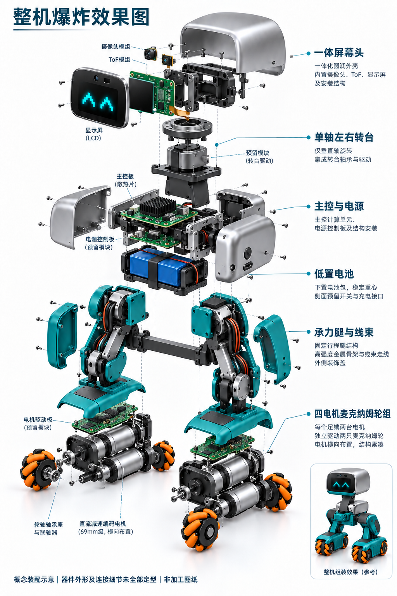

# Microduck 衍生宠物机器人：屏幕头与小麦克纳姆轮

归档日期：2026-09-09。**阶段：外观探索与空间布局；不是可打样整机工程。**

本目录保存从原版鸭子启发到当前方案的设计、修改和对话记录。原项目仍在仓库根目录 `microduck_rl/`，本次没有改写其训练、固件和机械参考文件。

## 最新要求

- 宠物机器人气质，延续鸭子的头身关系。
- 屏幕显示表情，顶部小摄像头与前向深度测距；取消机械嘴及嘴部舵机。
- 头部仅左右转动，取消俯仰机构。
- 小尺寸麦克纳姆轮，四轮独立电机驱动，目标约60 mm但SKU未定。
- 腿脚重新考虑电机、承重轴承、线束、驱动板；取消脚踝舵机。
- **用户要求以整机爆炸效果图为外观依据，实现可拖动的整机/局部爆炸。该高还原度模型尚未完成；现有简化交互模型被用户指出不符合要求。**

## 看哪里

| 内容 | 文件 | 状态 |
|---|---|---|
| 最新整机爆炸外观参考 | [效果图](concepts/exec-45c2b3f4-eb2d-42fb-9c85-e57055dfe0b6.png) | AI概念图；几何、连接细节不可靠 |
| 当前方案与待办 | [设计方案](docs/DESIGN.md) | 假设、选型和风险明确区分 |
| 修改历史 | [CHANGELOG](docs/CHANGELOG.md) | 包含被否定方案和纠正 |
| 对话记录 | [对话整理](docs/CONVERSATION.md) | 可见用户原文＋助手答复摘要，非完整系统导出 |
| 内部位置与包络 | [交互布局](layout/Exploded_Layout_V2.html)、[器件坐标](layout/parts.csv) | 42个编号，不是42个已完成零件 |
| 头部布局历史 | [头部V1](head/Head_Layout_V1.html) | 旧版；以最新要求为准 |
| 转头视频 | [MP4](animation/Head_Yaw_Demo.mp4) | 简化运动演示，非效果图精度 |
| 可拖动爆炸试验 | [浏览器入口](interactive/index.html) | 简化试验；非用户要求的高还原度成品 |
| 文件完整性 | [清单](MANIFEST.json) | SHA256与字节数 |

## 本地打开

GitHub文件页面不会执行HTML。下载本分支后，在本目录运行 `python -m http.server 8000`，打开 `http://localhost:8000/interactive/index.html` 或 `http://localhost:8000/layout/Exploded_Layout_V2.html`。三维试验依赖网络加载固定版本Three.js与WebGL。包络布局页不依赖外部库。

## 不能据此采购或生产

没有完成新机器人主板/驱动PCB、最终CAD零件、加工孔位、可生产STL、轴承与轮轴选型、完整线束图或整机运动控制。42项包络只对部分电子器件做矩形相交检查。概念图片不能证明电机、轮轴、线束和螺钉能装上。

原版模型的非商业/署名/相同方式共享约束需按上游具体授权核对，不能因本目录归档就认定可商用。原模型来源与现有仓库授权保持原状。
